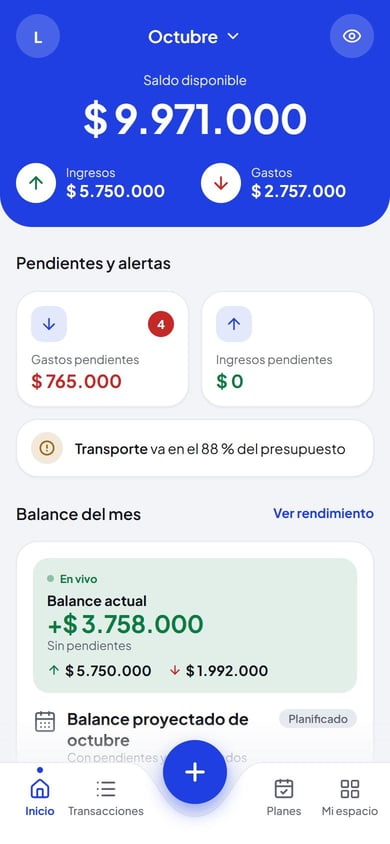
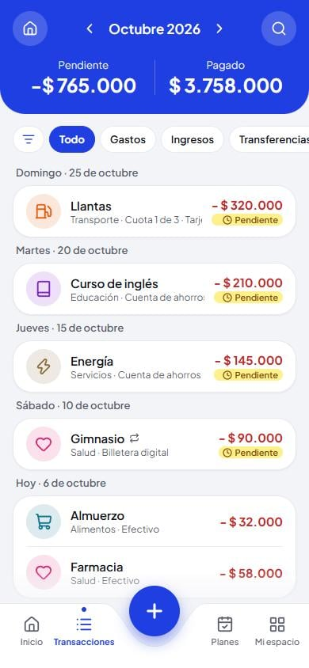
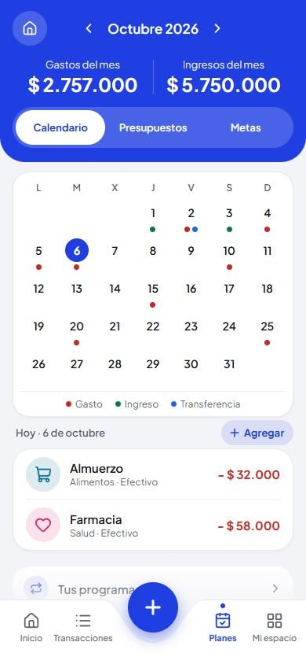
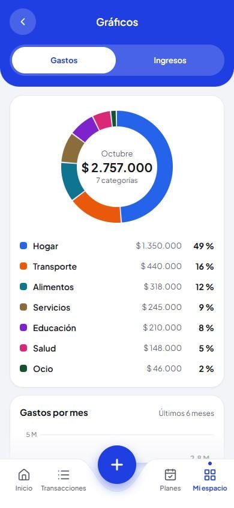
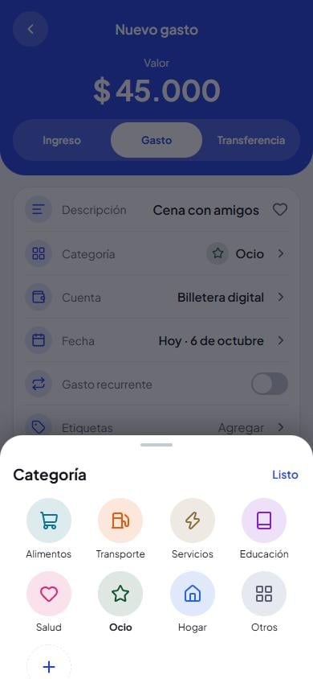
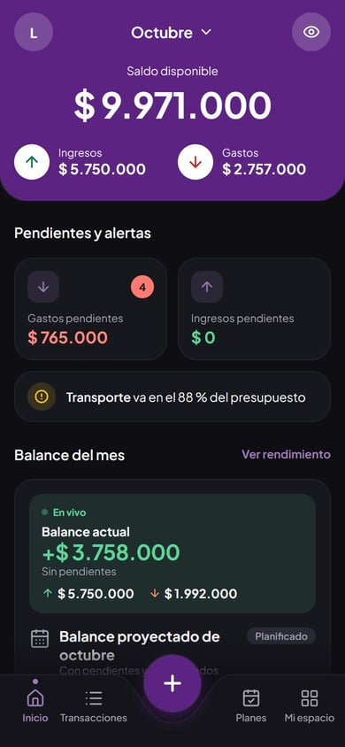

# Re-Coin

App de finanzas personales para el iPhone, hecha como **Progressive Web App (PWA)**: se instala desde Safari con "Añadir a pantalla de inicio", funciona sin conexión y guarda todos los datos **solo en el teléfono**, sin servidor ni cuentas de usuario.

Demo: <https://sendo-rho.vercel.app> (cada visitante empieza con la app vacía; lo que registre se queda en su propio navegador).

<p align="center">
  
  
  
</p>
<p align="center">
  
  
  
</p>

<p align="center"><sub>Capturas con datos de ejemplo inventados.</sub></p>

## Qué hace

- **Cuentas** (banco, billetera, efectivo…) con saldo calculado a partir de los movimientos, y **reajuste de saldo** cuando el real no coincide.
- **Movimientos**: gastos, ingresos y transferencias, pagados o pendientes, con categorías, etiquetas, notas y favoritos.
- **Tarjetas de crédito**: compras a cuotas repartidas en sus facturas, fechas de cierre y de pago, y pago de la factura desde una cuenta.
- **Recurrentes** (arriendo, sueldo, suscripciones): diarios, semanales, quincenales, mensuales o anuales. Se pueden editar o borrar solo una fecha, de una fecha en adelante o toda la serie.
- **Planes**: calendario del mes, presupuestos por categoría (semanales a anuales, con avisos) y metas de ahorro con aportes.
- **Inicio** con saldo disponible, saldo estimado en meses futuros y saldo al cierre en meses pasados; bloques que se muestran, ocultan y ordenan.
- **Gráficos y rendimiento** del mes y de los últimos 6 meses.
- **Copia de seguridad** (JSON) y **exportación** a Excel (.xlsx) y CSV.
- Tema con 10 colores principales, modo claro, oscuro o automático.

La interfaz está en español de Colombia y los valores en pesos colombianos (`$ 1.284.300`).

## Decisiones técnicas

- **Local-first, sin backend.** Los datos viven en IndexedDB a través de [Dexie](https://dexie.org). La app pide almacenamiento persistente (`navigator.storage.persist()`); en iOS, las apps añadidas a la pantalla de inicio son las que conservan sus datos de forma más fiable. Como el teléfono es el único lugar donde están los datos, la app avisa cuándo conviene hacer una copia de seguridad.
- **Dinero en enteros.** Los valores se guardan en pesos enteros (sin decimales), así que no hay errores de redondeo de coma flotante. Las cuotas reparten el residuo en la primera.
- **Cálculos derivados, no guardados.** Saldos, facturas, cupo usado y totales se calculan a partir de los movimientos (`src/datos/`), así no pueden quedar desincronizados.
- **Migraciones de la base de datos** versionadas en `src/datos/db.js` (9 versiones). Las copias de seguridad llevan la versión y se validan tabla por tabla antes de reemplazar nada, en una sola transacción.
- **Sin librerías para lo que es pequeño**: los gráficos (dona y barras) son SVG propio y el .xlsx se arma a mano (zip sin compresión + XML mínimo).
- **Pensada para el iPhone**: transiciones entre pantallas propias (con `prefers-reduced-motion`), franja de color para la barra de estado de iOS, zona segura, vibración háptica y teclado numérico al abrir un formulario.
- **Nombre interno "sendo"**: la app se llamaba así. La base de datos, las claves de `localStorage` y la marca de las copias conservan ese nombre a propósito: cambiarlo borraría los datos de quien ya la usa o invalidaría sus copias.

## Stack

| Parte | Herramienta |
|---|---|
| Interfaz | React 19, JavaScript (JSX), CSS propio con variables |
| Rutas | React Router 7 (modo declarativo) |
| Datos | Dexie 4 + dexie-react-hooks (IndexedDB) |
| PWA | vite-plugin-pwa (Workbox, `generateSW`) |
| Build | Vite 8 |
| Íconos y fuente | Lucide, Plus Jakarta Sans (servida por la propia app) |
| Calidad | ESLint, Vitest (+ fake-indexeddb), GitHub Actions |
| Hosting | Vercel (cada push a `main` se publica) |

## Estructura

```
src/
  datos/        modelo, base de datos y cálculos (saldos, tarjetas, recurrentes, presupuestos…) y sus pruebas
  pantallas/    una pantalla por ruta
  componentes/  piezas reutilizables (paneles, formularios, gráficos, transiciones)
  estado/       estado compartido fuera de la base de datos (ajustes, mes elegido, ventanas)
  tema/         colores del tema y contraste
  utilidades/   fechas, formato de pesos, animaciones, teclado
design/         diseño previo de cada pantalla (capturas y HTML estático, claro y oscuro)
public/         íconos de la app
```

## Desarrollo

Requisitos: Node.js 20.19+ o 22.12+ (lo pide Vite 8).

```bash
npm ci
npm run dev        # servidor de desarrollo
npm test           # pruebas
npm run lint       # reglas de calidad
npm run build      # versión de producción en dist/
npm run preview    # sirve dist/ (con el service worker)
npm run iconos     # regenera los íconos a partir de public/icono.svg
```

Para probarla en un teléfono de la misma red: `npm run dev:red` o `npm run preview:red`. El service worker y la instalación necesitan HTTPS, así que en el iPhone se prueba la versión publicada.

## Pruebas

Las pruebas cubren la lógica donde un error cuesta dinero o datos: facturas y cuotas de tarjeta, saldos (también al cierre de un mes y estimados), fechas de los recurrentes (meses cortos, años bisiestos, quincenas, fechas quitadas), registro de recurrentes sin duplicados, periodos de presupuestos, metas de ahorro, validación de copias de seguridad y exportación a CSV y Excel. La interfaz se revisa a mano en el iPhone.

## Privacidad

Nada sale del teléfono: no hay servidor, analítica ni servicios de terceros. Si se borra la app de la pantalla de inicio, iOS borra sus datos con ella; por eso existe la copia de seguridad.

## Licencia

[MIT](LICENSE) © 2026 José Francisco Martínez Aguilar.
